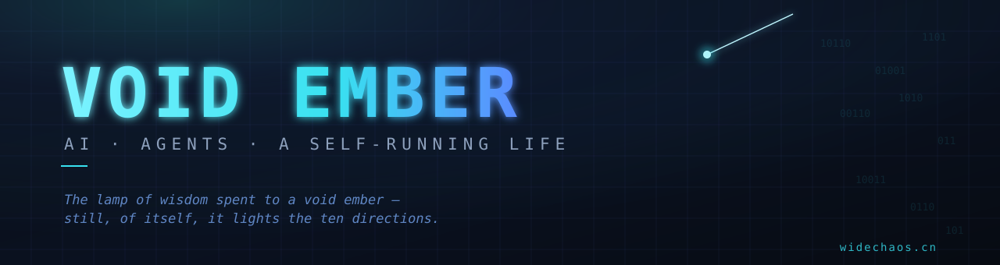

<p align="center">
  
</p>

<p align="center">
  <b>智灯已灭余空烬，犹自光明照十方</b><br>
  <sub><i>The lamp of wisdom, spent to a void ember — still, of itself, it lights the ten directions.</i></sub>
</p>

---

```console
> whoami
  邬仁超 · 十方空烬 · Void Ember
  AI engineer & builder — I follow interesting problems wherever they lead.

> cat ./manifesto
  短期促进经济，长期促进革命。
  Short-term, fueling the economy. Long-term, fueling the revolution.

> ls ./domains
  ai-applications   agents   cloud-native   dev-tools   automation   writing

> ./now
  ● building at widechaos.cn — and whatever's next
```

### // building

- **[Heartiger](https://github.com/widechaos/Heartiger)** — an agent-driven personal life OS; a journal that becomes a *second brain* and evolves with you.
- **[deepseek-chat-navigator](https://github.com/widechaos/deepseek-chat-navigator)** — a smart sidebar that reads an AI chat and jumps you to any question or answer.
- **[DangmuNews](https://github.com/widechaos/DangmuNews)** — desktop danmaku news, headlines streamed across your screen.
- **[littletools](https://github.com/widechaos/littletools)** — a drawer of small tools, scripts and toys.
- **[lingzhi-vision](https://github.com/widechaos/lingzhi-vision)** — a concept piece; an idea rendered as a page.
- **[widechaos-blog](https://github.com/widechaos/widechaos-blog)** — thinking out loud, in the open.

### // built with


### // find me

<p>
  🌐&nbsp; <a href="https://widechaos.cn">widechaos.cn</a> &nbsp;·&nbsp; ✉️&nbsp; ai@widechaos.cn
</p>

<sub><i>"From the ashes a fire shall be woken, a light from the shadows shall spring." — J.R.R. Tolkien</i></sub>
