<p align="center">
  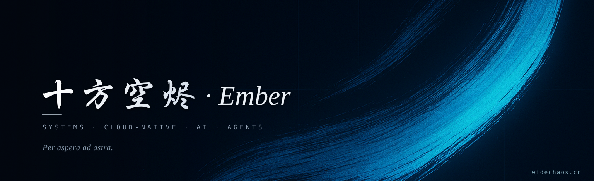
</p>

<p align="center">
  <b>智灯已灭余空烬，犹自光明照十方</b><br>
  <sub><i>"From the ashes a fire shall be woken, a light from the shadows shall spring." — J.R.R. Tolkien</i></sub>
</p>

---

## // about

**AI, backend & cloud engineer.** I build agents and knowledge systems, data-driven applications, and the infrastructure that keeps them running.

```console
> whoami
  邬仁超 · 十方空烬 · Ember

> ls ./domains
  AI & agents        machine learning & data
  backend & APIs     web crawling & automation
  cloud & storage    voice & realtime systems

> ./now
  Voice agents for real phone calls.
  ASR → LLM → TTS.
  Notes and experiments at widechaos.cn.
```

<details>
<summary><b>./manifesto</b></summary>

短期促进经济，长期促进革命。<br>
Short-term, fueling the economy. Long-term, fueling the revolution.

</details>

## // selected work

- **[deepseek-chat-navigator](https://github.com/widechaos/deepseek-chat-navigator)** — a browser userscript that turns long DeepSeek conversations into a question-and-answer outline with one-click navigation. [Install ↗](https://greasyfork.org/zh-CN/scripts/560039-deepseek-chat-navigator)
- **[Bulletin](https://github.com/widechaos/Bulletin)** — a Python + Qt desktop news overlay: live headlines, a transparent window, and click-through interaction.
- **[obsidian-cinematic-ui](https://github.com/widechaos/obsidian-cinematic-ui)** — a cinematic CSS motion layer for Obsidian: glass callouts, breathing alerts, image reveals.
- **[Heartiger](https://github.com/widechaos/Heartiger)** — designing an agent-driven personal life OS: lightweight journaling, intelligent organization, and a growing second brain.
- **[widechaos-blog](https://github.com/widechaos/widechaos-blog)** — thinking out loud, in the open → [widechaos.cn](https://widechaos.cn).

<!-- OPEN-SOURCE-CONTRIBUTIONS:START -->
## // open-source contributions

[Contribution notes and pull requests →](contributions/README.md)
<!-- OPEN-SOURCE-CONTRIBUTIONS:END -->

## // toolbox

<p>
  <b>AI &amp; Agents</b><br>
        
</p>

<p>
  <b>Machine Learning &amp; Data</b><br>
       
</p>

<p>
  <b>Voice &amp; Realtime</b><br>
       
</p>

<p>
  <b>Backend</b><br>
       
</p>

<p>
  <b>Databases &amp; Retrieval</b><br>
       
</p>

<p>
  <b>Web Crawling &amp; Automation</b><br>
     
</p>

<p>
  <b>Cloud &amp; Storage</b><br>
        
</p>

<p>
  <b>Frontend</b><br>
       
</p>

<p>
  <b>Testing &amp; Delivery</b><br>
    
</p>

## // community badges

<!-- COMMUNITY-BADGES:START -->
<p>
  <a href="assets/certificates/databricks-generative-ai.png">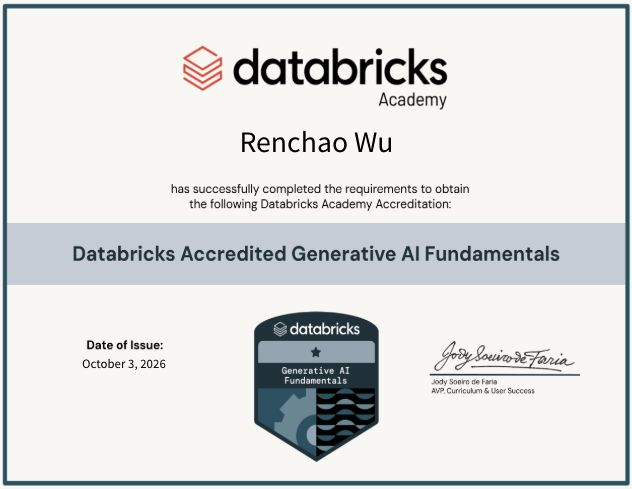</a> &nbsp;
  <a href="assets/certificates/databricks-ai-agent.png"></a> &nbsp;
  <a href="assets/certificates/databricks-ai-security.png"></a> &nbsp;
  <a href="assets/certificates/huggingface-agents-unit1.png"></a> &nbsp;
  <a href="assets/certificates/huggingface-agents-course.png"></a> &nbsp;
  <a href="assets/certificates/alibaba-cloud-generative-ai.png">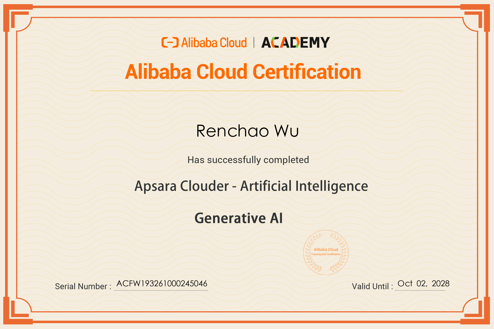</a> &nbsp;
  <a href="assets/certificates/cognitive-class-prompt-engineering.png">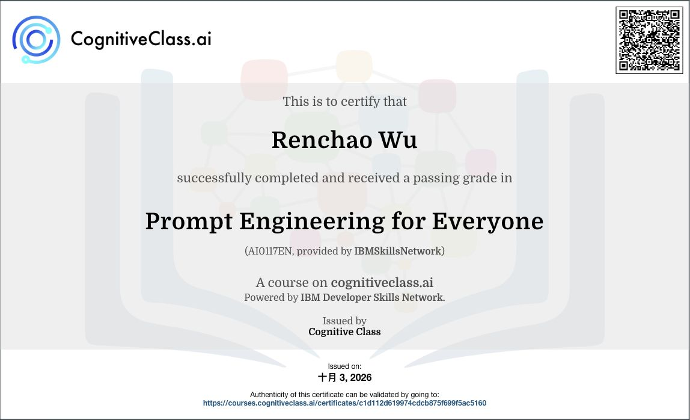</a> &nbsp;
  <a href="assets/certificates/cognitive-class-chatbot.png">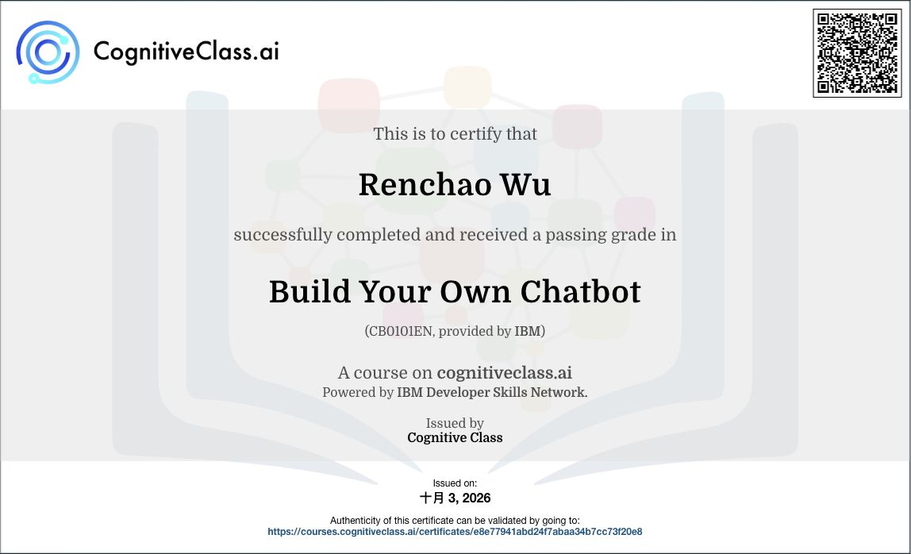</a> &nbsp;
  <a href="assets/certificates/cognitive-class-fundamentals-ai.png">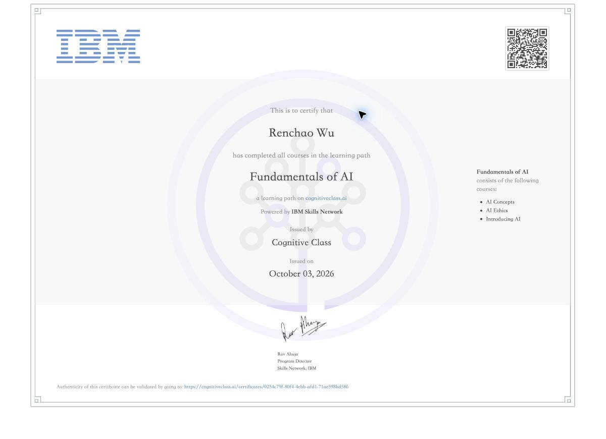</a> &nbsp;
  <a href="assets/certificates/cognitive-class-machine-learning.png">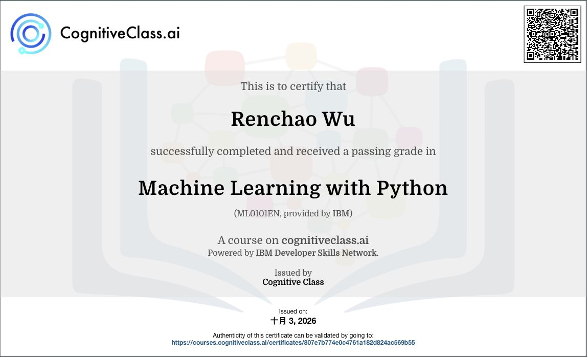</a> &nbsp;
  <a href="assets/certificates/ibm-skillsbuild-ai-fundamentals.png">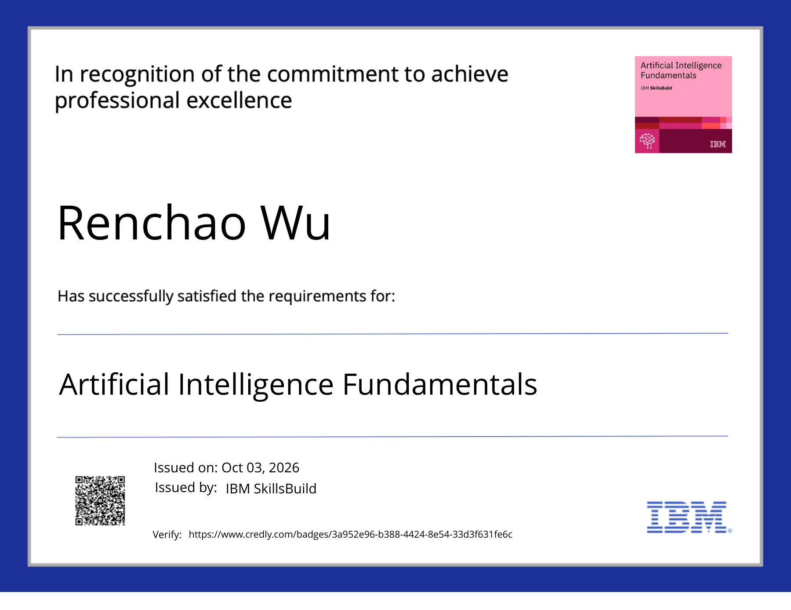</a>
</p>

<sub>AI learning · <a href="https://credentials.databricks.com/df0c7dc3-88d9-4de0-99d4-781e917aae76">Generative AI Fundamentals</a> · <a href="https://credentials.databricks.com/d56e8b1d-3c06-43cb-8b4f-6f4d6778a9fc">AI Agent Fundamentals</a> · <a href="https://credentials.databricks.com/7c66e79f-43fd-4b94-8f2a-12a2c8f16739">AI Security Fundamentals</a> · <a href="https://huggingface.co/datasets/agents-course/certificates/resolve/main/certificates/WideChaos/2026-10-03.png">Hugging Face Agents · Unit 1</a> · <a href="https://huggingface.co/datasets/agents-course/final-certificates/resolve/main/certificates/WideChaos/2026-10-03.png">Hugging Face Agents · Full course</a> · <a href="assets/certificates/alibaba-cloud-generative-ai.png">Alibaba Cloud · Generative AI</a> · <a href="https://courses.cognitiveclass.ai/certificates/c1d112d619974cdcb875f699f5ac5160">IBM Skills Network · Prompt Engineering</a> · <a href="https://courses.cognitiveclass.ai/certificates/e8e77941abd24f7abaa34b7cc73f20e8">IBM · Build Your Own Chatbot</a> · <a href="https://cognitiveclass.ai/certificates/0254c79f-80f4-4ebb-afd1-71ae598bd586">IBM Skills Network · Fundamentals of AI</a> · <a href="https://courses.cognitiveclass.ai/certificates/807e7b774e0c4761a182d824ac569b55">IBM · Machine Learning with Python</a> · <a href="https://www.credly.com/badges/3a952e96-b388-4424-8e54-33d3f631fe6c/public_url">IBM SkillsBuild · Artificial Intelligence Fundamentals</a></sub>

<p>
  <a href="https://www.kaggle.com/certification/badges/xover2022/107"></a> &nbsp;
  <a href="https://www.kaggle.com/certification/badges/xover2022/30"></a> &nbsp;
  <a href="https://www.kaggle.com/certification/badges/xover2022/37"></a> &nbsp;
  <a href="https://www.kaggle.com/certification/badges/xover2022/50"></a> &nbsp;
  <a href="https://www.kaggle.com/xover2022"></a> &nbsp;
  <a href="https://dev.to/widechaos"></a>
</p>

<sub><a href="https://www.kaggle.com/xover2022">Kaggle</a> · <a href="https://dev.to/widechaos">DEV</a></sub>

<p>
  <a href="https://weread.qq.com" title="WeRead · 2,000 reading hours">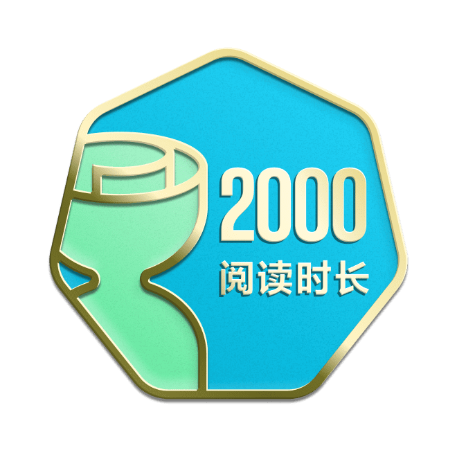</a> &nbsp;
  <a href="https://weread.qq.com" title="WeRead · 2,000 reading days"></a> &nbsp;
  <a href="https://weread.qq.com" title="WeRead · 500 books read"></a> &nbsp;
  <a href="https://weread.qq.com" title="WeRead · 100 books finished"></a> &nbsp;
  <a href="https://weread.qq.com" title="WeRead · 50 highly rated books read"></a> &nbsp;
  <a href="https://weread.qq.com" title="WeRead · 30 consecutive reading days">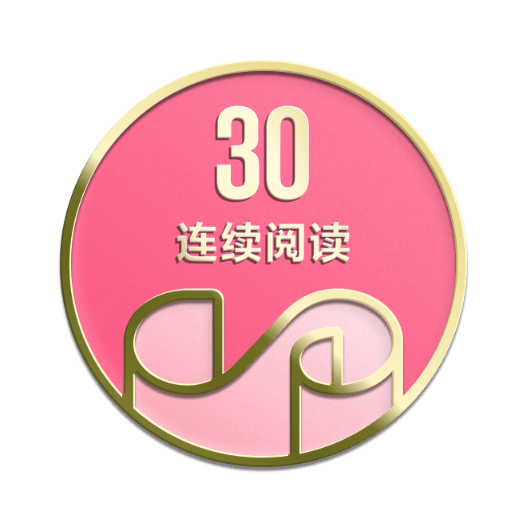</a> &nbsp;
  <a href="https://weread.qq.com" title="WeRead · 3,000 likes received"></a> &nbsp;
  <a href="https://weread.qq.com" title="WeRead · 200 thoughts shared">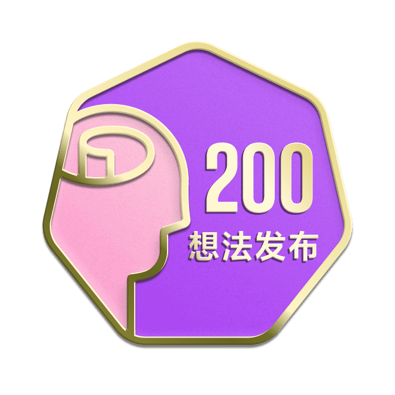</a> &nbsp;
  <a href="https://weread.qq.com" title="WeRead · 10 book reviews"></a> &nbsp;
  <a href="https://weread.qq.com" title="WeRead · Book recommendations for 10 readers"></a> &nbsp;
  <a href="https://weread.qq.com" title="WeRead · 21-day Reading Challenge">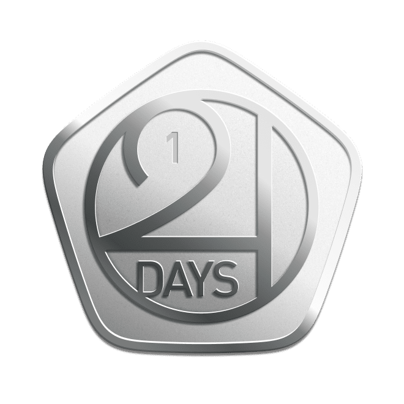</a> &nbsp;
  <a href="https://weread.qq.com" title="WeRead · World Book Day · Mountain and River Poet"></a>
</p>

<sub>WeRead · Reading milestones</sub>

<details>
<summary>More reading badges</summary>

<p>
  <a href="https://weread.qq.com" title="WeRead · World Book Day · Mountain and River Poet"></a> &nbsp;
  <a href="https://weread.qq.com" title="WeRead · 21-day Reading Challenge"></a> &nbsp;
  <a href="https://weread.qq.com" title="WeRead · 2,000 reading days"></a> &nbsp;
  <a href="https://weread.qq.com" title="WeRead · 50 highly rated books read"></a> &nbsp;
  <a href="https://weread.qq.com" title="WeRead · 500 books read"></a> &nbsp;
  <a href="https://weread.qq.com" title="WeRead · 2,000 reading hours"></a> &nbsp;
  <a href="https://weread.qq.com" title="WeRead · 100 books finished"></a> &nbsp;
  <a href="https://weread.qq.com" title="WeRead · Book recommendations for 10 readers"></a> &nbsp;
  <a href="https://weread.qq.com" title="WeRead · 50 books finished"></a> &nbsp;
  <a href="https://weread.qq.com" title="WeRead · 10 book reviews"></a> &nbsp;
  <a href="https://weread.qq.com" title="WeRead · 5 book reviews">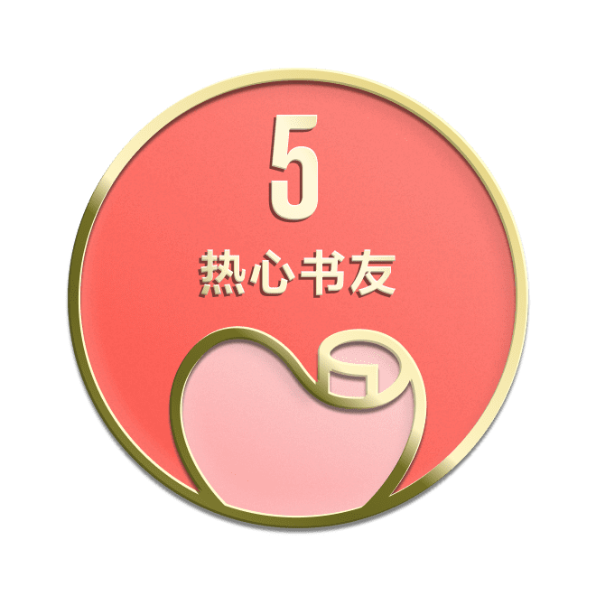</a> &nbsp;
  <a href="https://weread.qq.com" title="WeRead · 10 highly rated books read">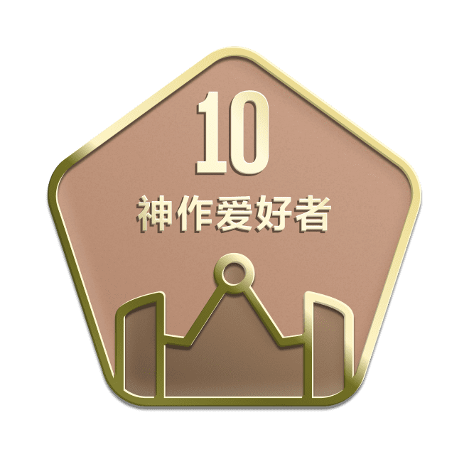</a> &nbsp;
  <a href="https://weread.qq.com" title="WeRead · 5 highly rated books read">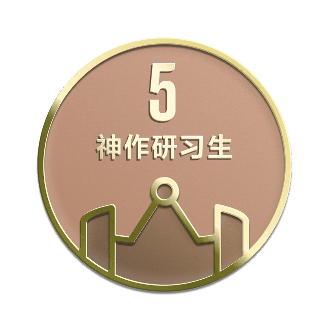</a> &nbsp;
  <a href="https://weread.qq.com" title="WeRead · 3,000 likes received"></a> &nbsp;
  <a href="https://weread.qq.com" title="WeRead · 1,000 reading days"></a> &nbsp;
  <a href="https://weread.qq.com" title="WeRead · 200 thoughts shared"></a> &nbsp;
  <a href="https://weread.qq.com" title="WeRead · 100 thoughts shared"></a> &nbsp;
  <a href="https://weread.qq.com" title="WeRead · 50 thoughts shared"></a> &nbsp;
  <a href="https://weread.qq.com" title="WeRead · 10 thoughts shared"></a> &nbsp;
  <a href="https://weread.qq.com" title="WeRead · 2,000 likes received"></a> &nbsp;
  <a href="https://weread.qq.com" title="WeRead · 1,000 likes received"></a> &nbsp;
  <a href="https://weread.qq.com" title="WeRead · 500 likes received"></a> &nbsp;
  <a href="https://weread.qq.com" title="WeRead · 100 likes received"></a> &nbsp;
  <a href="https://weread.qq.com" title="WeRead · 50 likes received"></a> &nbsp;
  <a href="https://weread.qq.com" title="WeRead · 10 books finished"></a> &nbsp;
  <a href="https://weread.qq.com" title="WeRead · 100 books read"></a> &nbsp;
  <a href="https://weread.qq.com" title="WeRead · 50 books read"></a> &nbsp;
  <a href="https://weread.qq.com" title="WeRead · 500 reading days"></a> &nbsp;
  <a href="https://weread.qq.com" title="WeRead · 365 reading days"></a> &nbsp;
  <a href="https://weread.qq.com" title="WeRead · 200 reading days"></a> &nbsp;
  <a href="https://weread.qq.com" title="WeRead · 100 reading days"></a> &nbsp;
  <a href="https://weread.qq.com" title="WeRead · 1,000 reading hours">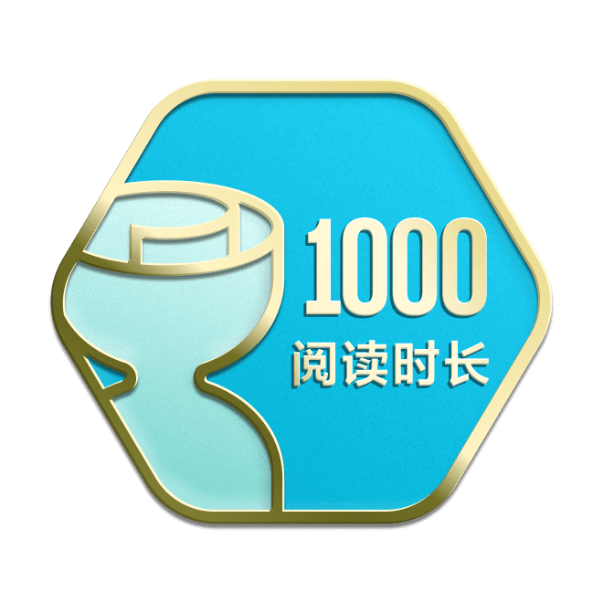</a> &nbsp;
  <a href="https://weread.qq.com" title="WeRead · 500 reading hours">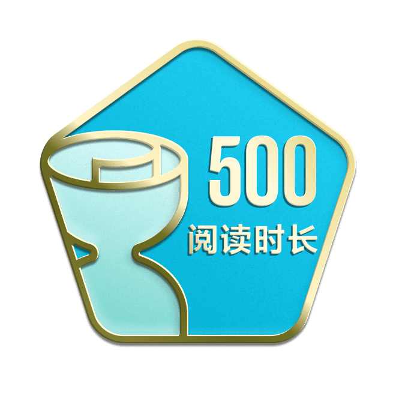</a> &nbsp;
  <a href="https://weread.qq.com" title="WeRead · 100 reading hours"></a> &nbsp;
  <a href="https://weread.qq.com" title="WeRead · 30 consecutive reading days"></a>
</p>

</details>
<!-- COMMUNITY-BADGES:END -->

## // connect

<p>
  <a href="https://widechaos.cn">Blog · widechaos.cn</a> &nbsp; / &nbsp; <a href="mailto:ai@widechaos.cn">Email · ai@widechaos.cn</a>
</p>

<sub><i>Per aspera ad astra.</i></sub>
